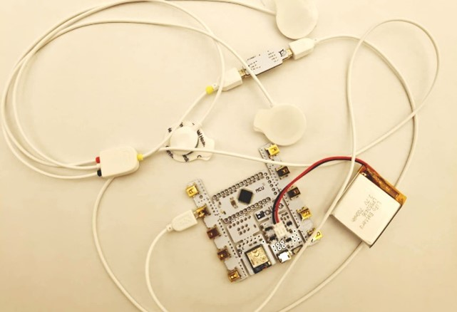

# Brain Powered Buggy Design

Author: George Zhao - Newcastle University Msc graduate 2023

**Abstract** — Brain-Computer Interface (BCI) technologies enable direct communication between the human brain and external devices, significantly benefiting those with movement restrictions. This paper presents a single channel real-time BCI system, steered by electroencephalogram (EEG) signals. Distinct cognitive states (relaxed and focused) are used to direct the buggy's movement. The system consists of five critical modules: communication, data acquisition & preprocessing, machine learning (employing Support Vector Machine), monitoring (using pyQt for visualization), and execution. By employing the Support Vector Machine with the Radial Basis Function kernel, it achieved a classification accuracy of 0.91. Practical tests confirmed that the buggy's movement corresponded accurately with the user's cognitive intentions, although environmental changes and subject variations influenced system accuracy.

**摘要** - 脑机接口（BCI）技术能够实现人脑与外部设备之间的直接通信，极大地惠及了运动受限的人群。本文介绍了一个由脑电图（EEG）信号控制的单通道实时BCI系统。该系统使用不同的认知状态（放松和集中）来指导小车的移动。该系统包括五个关键模块：通信、数据采集与预处理、机器学习（采用支持向量机）、监控（使用pyQt进行可视化）和执行。通过采用带有径向基函数核的支持向量机，实现了0.91的分类准确率。实际测试证实，小车的移动与用户的认知意图准确对应，尽管环境变化和受试者差异影响了系统的准确性。

## Operating Environment

This project is entirely programmed in Python, using PyCharm as the IDE, and is run in a venv environment (there's a venv folder in the root directory that needs to be configured individually). The hardware platform adopts the [BITalino (r)evolution Plugged Kit BLE/BT](https://www.pluxbiosignals.com/collections/bitalino) and an EEG sensor kit. The buggy is powered by the mBot2 robot.

(ps: I strongly advise NOT using this robot. It is primarily designed for graphical programming. Although it supports Python, there is a significant lack of documentation. After final testing, issues were identified with the robot's communication module. The graphical nature of the programming design makes debugging extremely challenging. We recommend purchasing a communication module and motor to build your own buggy (you may need to modify the code of the communication module). I may work on this.)

本项目完全采用Python编程，IDE是PyCharm，venv环境（根目录下有venv文件夹，需自行配置）。硬件平台采用[BITalino (r)evolution Plugged Kit BLE/BT](https://www.pluxbiosignals.com/collections/bitalino)以及EEG传感器套件。小车使用了mBot2机器人。

（ps: 强烈不推荐使用这个机器人，该机器人主要为图像化编程设计，虽然支持Python但文档资料非常少。最终测试后，机器人其通信模块存在问题，然而图形化的编程设计导致debug非常困难。推荐自行购买通讯模块和电机搭建小车（可能需要修改通信模块的代码），如果有时间我会做）

## Main page

This page primarily provides an introduction to the principles of system implementation. The two buttons below lead to the preprocessing page and the operation page, respectively.

这一页主要是关于系统实现原理的介绍，下面的两个按钮分别指向预处理页面和运行页面

## Page 1

This system needs to be used in conjunction with the Opensignals program, which can be downloaded here: [Opensignals Download](https://support.pluxbiosignals.com/knowledge-base/introducing-opensignals-revolution/). You need to create an "app" folder in the project root directory and copy the "OpenSignals (r)evolution" folder from the installation directory into the "app" folder.

本系统需要与Opensignal程序结合使用，下载地址在[这里](https://support.pluxbiosignals.com/knowledge-base/introducing-opensignals-revolution/)。须在项目根目录下创建app文件夹，并将安装目录的OpenSignals (r)evolution文件夹复制到app文件夹下。

## Page 2

If you have completed the previous steps and turned on the power of the buggy, all indicators under "Connection Status" should turn green. At this point, you need to collect sample data. 

First, click the red button to clear the cache, then select State 1 and State 2 to collect EEG waveforms for about 60 seconds in different states. Click the "Start Generation" button to initiate model training, which will take approximately 2-3 minutes. Once you see the generation results, click the green start button, and you will observe the EEG signal waveform and the Probability Density Function (PSD) graph. 

The three small lights in the "Result" module represent the predictions of the last three times; if all three predictions are the same, the buggy will respond by moving forward or stopping accordingly. You can also manually click the "Forward" and "Backward" buttons to test the buggy. Have fun!

如果你完成了之前步骤并且打开了小车电源，“Connection Status” 的标识符应该都变为绿色。这时候，需要采集样本信息。

首先按红色按清空缓存，分别选取 State 1 和 State 2，在不同的状态下收集约 60s 的脑电波形。点击 “Start Generation” 按钮启动模型训练，大概需要 2~3 分钟时间。看到生成结果后，点击绿色开始按钮，你会看到脑电信号波形和概率密度函数 (PSD) 的图像。

“Result” 模块的三个小灯表示近三次的预测结果，如果三次的结果相同，小车将根据结果做出前进或停止的反应。当然你也可以手动点击 “Move Forward” “Move Backward” 按钮来测试小车。玩的开心！